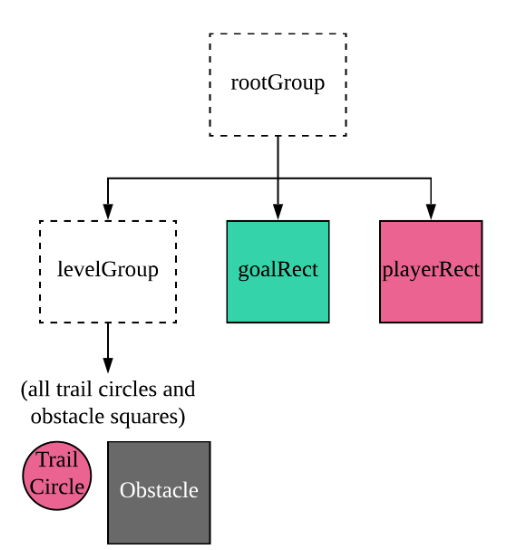

# PSA 6: Streamline GUI
This PSA is due November 26, Tuesday, 11:59pm

## Introduction
After completing the Streamline backend for PSA3, were you left unsatisfied by how dull your game looked? We have some unfinished work to do! Now it’s time to use your graphical knowledge from Critters and Shapes to learn **JavaFX**, a Java library for implementing aesthetic programs. JavaFX will let you design a beautiful visualization of your Streamline game, which will amaze your friends and even a recruiter or two!


This assignment will build off of your Streamline implementation in PSA3. If the code for your Streamline backend has any bugs, we encourage you to fix them. There will be a separate Gradescope submission script that will provide you information about the fixes that you will be need to make in order to have a perfect functioning Streamline backend. It is **strongly encouraged** for testing purposes (**but not required**) that you fix your bugs in your backend code, but in the end, you will only need to submit the GUI.

**Warning: we will use our own GameState.java and Streamline.Java to test your GUI. We assume that the public method signatures in these two files are the same as in PA3. So when you write your GUI code, make sure you don't change any method signatures in the aforementioned java files. We will provide more details near the bottom of this page.**

Also no one is allowed to borrow other student's PA3 to test your GUI for PA6. It is an academic integrity violation if it happens.

## Starter Code
Copy the starter code using the same command as in the previous PSAs (refer to PSA 0 if you need a refresher). The starter code is located at the following path:
```
~/../public/psa6
```
Also, copy over `GameState.java`, and `Streamline.java` from PSA 3. 
We have a PA3 Checker on GradeScope so you can check your backend logic.

Backup your code as you progress through the assignment. Remember that Gradescope can serve as storage for your code. Start early, submit often.

## On Grading
To avoid any repeated penalty for Streamline, we will grade your PSA 6 submission with our reference `GameState.java` and `Streamline.java`. To ensure that your code is able to compile with ours, in your `GuiStreamline.java` you can **only access these variables / constructors / methods:**

In Streamline.java:
```java
GameState currentState;
List<GameState> previousStates;
public Streamline();
public Streamline(String filename);
void recordAndMove(Direction direction);
void undo();
void saveToFile();
```
In GameState.java:
```java
final static char TRAIL_CHAR;
final static char OBSTACLE_CHAR;
final static char SPACE_CHAR;
char[][] board;
int playerRow;
int playerCol;
int goalRow;
int goalCol;
boolean levelPassed;
public GameState(int height, int width, int playerRow, int playerCol, int goalRow, int goalCol);
public GameState(GameState other);
void addRandomObstacles(int count);
void rotateCounterClockwise();
void moveUp();
void move(Direction direction);
public String toString();
public boolean equals(Object other);
```
When you submit to GradeScope, the submission script will attempt to compile your submission with our code, and tell you whether the compilation successful or not. 

**Read the submission output.**
* When we grade, we will use our version of `GameState.java` and `Streamline.java`. Therefore, you should make sure your versions earn a full score on the checker on Gradescope. This way, you can be sure that your `GuiStreamline.java` will be compatible with our files. 

## FAQ
1. Why isn't the Color object working with JavaFX, even though I imported java.awt.Color ?
    * Use `javafx.scene.paint.*` instead of `java.awt.Color`. **Do not use java.awt.Color.**
1. Can I use switch/case statements for this PSA?
    * Yes, but make sure you use them correctly. See the [Java tutorials](https://docs.oracle.com/javase/tutorial/java/nutsandbolts/switch.html) for more detail.
1. Why aren't my elements updating or changing colors?
    *  Once you have the elements in your grid, you can just update the colors/characteristics of the existing elements, instead of adding new changed elements. Do not add new elements as the game progresses; otherwise, you may run into sad runtime errors.
1. Ahhhh my code keeps running into JavaFX Runtime errors!!
    * JavaFX doesn’t do well when new elements are added as the game progresses. **Do not add any new elements into your Group in your event handler.** However, you can freely change the state (color, text, font, etc) of any object already in the Group.
1. JavaFX isn't working when I SSH! Or, I have a "libGL" error, what should I do?
    * **First thing to check:** If you are running with SSH, make sure you have XQuartz and are using -Y (if on Mac) or -X (if on Windows). 
        * **Piazza recommendation:** Downgrading XQuartz to 2.7.8 and ignore error messages.
    * If you are getting one of the messages below:
        * `java.lang.UnsupportedOperationException: Unable to open DISPLAY`
        * `X Error of failed request: BadValue`
    * Either go to the lab (guaranteed to work) or copy over the files to your own computer to work locally (Mac only). If your code doesn't compile on your own machine, try running the two commands below in your terminal:
        * `brew install openjdk`
        * `brew install openjfx`
1. What is the relationship between Stage/Scene/Pane/etc.?
    * See p. 539 of the textbook, Section 14.4

## Short Intro to GUI Elements
For the GUI portion of the assignment, we recommend you refer to **Chapter 14** in your textbook. It has wonderful examples of how to add GUI components to a Scene.  There are a few classes which you should familiarize yourself with and which you will need to use to complete the assignment: 

* **Group**
* **Circle**
* **Rectangle**
* **Color**

Here is a quick “Get Started” guide on how to put GUI elements into a window, and displaying them.

### Group
A Group is used as a **container** for all of the objects that are in a window.  It is essentially a way to organize the various components that you will be displaying.

UI elements are added to groups by calling the `add()` and `remove()` methods on the child property of the group. For example:
```java
group.getChildren().add(child);
group.getChildren().remove(child);
```
Groups 

* [Java documentation for Group](https://docs.oracle.com/javase/10/docs/api/javafx/scene/Group.html)

The Streamline GUI uses two groups: a main group and a level group.



### Circle
We recommend that you use the Circle class from the JavaFX library to make the trail dots.  Here’s a useful constructor:
```java
public Circle(double centerX,
              double centerY,
              double radius,
              Paint fill)
```
* [Java documentation for Circle](https://docs.oracle.com/javase/10/docs/api/javafx/scene/shape/Circle.html)
* Hint: read up on how to change the color of a Circle.

### Rectangle
We recommend that you use the Rectangle class from the JavaFX library to make the Streamline grid.  Section 14.11.3 discusses how to use the Rectangle class. Here’s a useful constructor:
```java
Rectangle(double width, double height, Paint fill)
```
* [Java documentation for Rectangle](https://docs.oracle.com/javase/10/docs/api/javafx/scene/shape/Rectangle.html)
* Hint: read up on how to change the color of a Rectangle.

### Color
We will make extensive use of the Color class.  You can use the `setFill(Color c)` method for Circle and Rectangle objects to change their color. There is more information on the Color class in Section 14.7 of your textbook.
- **DO NOT** use `java.awt.Color` for this PSA. Use `javafx.scene.paint.*` instead.
- [Java documentation for Color](https://docs.oracle.com/javase/10/docs/api/javafx/scene/paint/Color.html)


## Understanding the Starter Code
Initializing the GUI begins in the `start()` method. We first need to create a pane that we can add elements to. While we’re at it, let’s do a bit of formatting! (**Code in this subsection is provided**, magic numbers are present here for demonstration, but not in the actual starter code.)

```java
// Initialize the scene and our groups
rootGroup = new Group();
mainScene = new Scene(rootGroup, 500, 600, Color.GAINSBORO);
levelGroup = new Group();
rootGroup.getChildren().add(levelGroup);
```
**What does this do?** The above code establishes our group hierarchy. It creates all the groups, player shape, and goal shape, and adds them as children of their new containers.

After you’re done adding everything to the group, the following code shows the scene in the window when running the program:
```java
primaryStage.setTitle(TITLE);
primaryStage.setScene(mainScene);
primaryStage.setResizable(false);
primaryStage.show();
```
If we run this, we will have a window with nothing but a solid color background (you may have to resize the window since it’s empty):


## Getting Started
Now that we know how to get a blank window to show up, let’s try and create a cell that will be used to represent a tile of the game grid.

To do this, we’ll need to add a Rectangle to represent one tile, then add it into the pane. Add the following code at the **TODO** label at the `start()`: 
```Java
Rectangle aLonelySquare = new Rectangle(100, 100, 75, 75);
aLonelySquare.setFill(Color.LIMEGREEN);
rootGroup.getChildren().add(aLonelySquare);
```


Obviously you can’t play Streamline with just one Rectangle. Go ahead and remove the code for aLonelyRectangle. Now try initializing `goalRect` as an instance of `RoundedSquare` (a subclass of Rectangle provided as starter code) and adding it to the scene as above with aLonelyRectangle.

## Very Important Note Right Here
You want to **have access to the references** to objects you add to the scene, especially when you handle events. So that you can update them later (change their position, color, etc). We have provided instances variables `playerRect`, `goalRect`, `grid`, `trailsGrid`.

## Implementation Details
You will implement the GUI and the event handling code in **GuiStreamline.java** and **Player.java**. Look for the word "TODO" in the starter code comments. Your GUI is required to represent and display the **player**, the **goal**, **obstacles**, **zappers**, and **trail markers**.


## Player.java
To display the Player on the grid, we have created a `Player` class that `extends RoundedSquare`. You are responsible for filling in the constructor and the `setSize()` method.

```Java
public Player()
```

Choose two unique colors - use one for the fill color and the other from the stroke (outline) color. We allow one of these colors to match the trail color, if you prefer. Finally, set the stroke type to centered (see the documentation for [Rectangle](https://docs.oracle.com/javase/8/javafx/api/javafx/scene/shape/Rectangle.html)).

```Java
public void setSize(double size)
```
Follow the directions in the comments to update the stroke width and call super's `setSize()`.

## ZapperTriangle.java
We provide this completed file for you. 
You will need to create Zappers by calling the `ZapperTriangle` constructor in `GuiStreamline.java`. 

## GuiStreamline.java

### Colors
You can design your own color scheme, keep in mind that:
1. Each piece must have a legibly unique color (the player and trailing characters are the only exception. They may share the same color, as shown in the diagrams to the right). The colors must be **consistent** throughout the entire game.
2. You can create your own color or use the defaults from the [documentation](https://docs.oracle.com/javase/10/docs/api/javafx/scene/paint/Color.html).

Below are 2 color schemes for your inspiration.

 | 

### Instances Variables


```Java
Shape[][] grid;
```
Note that this is the Shape class from **JavaFX**, not to be confused with the Shape class from PSA 5!

This `grid` 2D array will have the same dimensions as `game.currentState.board`. It contains **obstacles** and **zappers**. 

```java
Shape[][] trailsGrid;
```
This `trailsGrid` 2D array will also have the same dimensions as `game.currentState.board`. It contains 2D array of **trail markers**. When a cell's trail marker is not present, we set the fill color of that cell in the `trailsGrid` to transparent(`Color.TRANSPARENT`); otherwise, we set it to `TRAIL_COLOR`. 

For example, below is a graphic representation of the contents of both the `grid` array and the `trailsGrid` array after the player has moved from the bottom left to the bottom right. The faded circles with dotted outlines represent invisible trail markers.


**Hint**: We recommend you allocate and initialize `grid` and `trailsGrid` in `resetGrid()`. 


```Java
Stage mainStage;
Scene mainScene;
Group levelGroup;         // For obstacles and trails
Group rootGroup;          // Parent group for all else
Player playerRect;        // UI element for the player
RoundedSquare goalRect;   // UI element for the goal
```

`levelGroup` contains all the UI elements that are **temporary** - the ones that are removed and recreated between levels. In other words, it contains all the same elements that are in the `grid` array.


```Java
Streamline game;                  // The current level
ArrayList<Streamline> nextGames;  // Future levels
```

These should be initialized for you by `loadLevels()`, which is given. 
- `game` is the level currently in play. 
- `nextGames` is any subsequent levels, not including the current level.

### Displaying the Grid
Before handling any key presses, you should create the display of the board with the width and height of the current Streamline game's board.

You will be filling the grid with Shapes to display the current state of the board. You will be using a `RoundedSquare` to represent the obstacle and goal, a `Player` object for player (i.e. a special RoundedSquare), and a `Circle` to represent the trail characters and empty spaces on the board (with a transparent Circle). 

To get the board's width and height, implement and use the following helper methods. You may find the **game** instance variable helpful for this. You will not need to do any conversion, as these return in units of squares not pixels.

```Java
public int getBoardWidth()
public int getBoardHeight()
```

Implement the following helper method to get the size of a single square on the board based on the width and height:

```Java
public double getSquareSize()
```

Assume we will stretch the board to completely fill the scene. You may find the width and height helper methods useful for this as well as the **mainScene** instance variable. 

### Updating the Grid

#### Overview
You should save the grid of Shapes in the **grid**  instance variable, because you need to change their type and color as the game progresses. **As the game progresses, the position of the player are updated by updating the Shapes in** `grid` **and changing the color of the Shapes in the** `grid`. 

You will soon implement the method `resetGrid()` which initializes the grid at the beginning of a game and also resets the grid between different levels of the game. You will also later implement the method `updateTrailColors()` to update the colors of the board.

```Java
public void updateTrailColors()
```
This is a method that recolors the tiles in the GUI. This could be used after every move or when we reload the game from Streamline backend. 

Feel free to change the `TRAIL_COLOR` and `ZAPPER_COLOR` constant to any color of your choice.

This means you should set the fill color of trail circles (remember that `trailsGrid` represents a 2D array of trail circles) making them visible or not
depending on if that `board` position equals `TRAIL_CHAR`. If that `board` position is equal to
`TRAIL_CHAR` and if the `grid` position is a `ZapperTriangle`, we want to set the fill of that `trailsGrid` position to `TRAIL_COLOR` and set the the `grid` position which is a `ZapperTriangle` to transparent. Conversely, if the `board` position is not equal to `TRAIL_CHAR` but the `grid` position is a `ZapperTriangle`, we want to set the `trailsGrid` position
to transparent and set the `grid `position which is a `ZapperTriangle` to the `ZAPPER_COLOR`.

See also the notes above for the `grid` and `trailsGrid` instance variables.

```Java
public void resetGrid()
```
When we start the game, we want to make sure that the previous game settings are cleared and the current state is correctly loaded. This function will be useful when the player passes one level and a new game is loaded.

In this method:
- Check the instance variables and determine which ones of them should be cleared
- Reset corresponding variables based on the current board stored in Streamline object
- If it is a zapper, call the `ZapperTriangle` constructor with appropriate arguments to create a zapper on the grid.

```Java
public void onLevelLoaded()
```
This method should be called after a completely new level has been loaded into the `game` instance variable, including the first level. Before calling this, we either have a blank (or mostly blank scene) or else a scene that doesn't match `game.currentState` at all (most likely from a previous level). After calling this, the UI should be in agreement with `game.currentState`.

Notice how `resetGrid()` would be helpful here. 

```Java
public void onPlayerMoved(int fromCol, int fromRow, int toCol, int toRow)
```
When a key is pressed by the player, this method will be called by the event handler that you will implement soon. This method is similar to `onLevelLoaded()` but you only need to update the trail and don't have to reset the whole board.


```Java
public void onLevelFinished()
```
Most of this method is completed. The starter code implements the EventHandler called ScaleTransition, which creates the goal animation at the end of every level.  All you will need to do is implement the following behaviors when the animation is finished. Basically:

- Check if there are more levels of games to read in
- If yes, load next level of game; If not, end the game.
The method `onLevelLoaded()` should be of help here.

At this point, you should be able to run GuiStreamline to observe the beginning of of a Streamline game. You should see the GUI displayed on your screen! But what if we want to manipulate the player square like shown below?

## How To Run Your Game
Like PSA 3, you can specify level(s) to load:
```
java GuiStreamline sample_levels
```
Or generate a single random level:
```
java GuiStreamline
```

 | 

## Handling Key Events

### Understanding the Starter Code

#### Remember how you needed to press Enter after every keyboard command in PSA 3? Let's solve that problem!

The starter code does not react to key presses, because we haven’t defined how to handle the key presses yet. We will define what each key press does in this **private class**:

```Java
class MyKeyHandler implements EventHandler<KeyEvent> {
  @Override
  public void handle(KeyEvent e) {
    // TODO
  }
}
```

Inside the `handle()` method is where you will write code to handle what the game should do when a key is pressed. 

The following is an example of how to add an event listener to the GUI window. This would typically be done in `start()`.

```Java
myKeyHandler = new MyKeyHandler();
scene.setOnKeyPressed(myKeyHandler);
```

### Handling KeyEvent 
When a key is pressed, `handle()` will be called, and a KeyEvent is passed in. We have provided a helper method `handleKeyCode()` you can then call. 

```Java
void handleKeyCode(KeyCode keyCode)
```

Based on which key is pressed, your game should do the following:

- \<up arrow\> or \<w\>- move up
- \<down arrow\> or \<s\> - move down
- \<left arrow\> or \<a\> - move left
- \<right arrow\> or \<d\> - move right
- \<u\> - undo
- \<o\> - output to file
- \<q\> - quit

(We’re using the arrow keys as well as WASD. You shouldn’t need to change any PSA 3 code for this).

Notice this is very similar to `play()` in Streamline.java, except that now, instead of using a Scanner to read the user input, we use the **KeyEvent** (and its **KeyCode**) to distinguish which key is pressed. The following documentation should be helpful:

[KeyEvent](https://docs.oracle.com/javase/8/javafx/api/javafx/scene/input/KeyEvent.html)

[KeyCode](https://docs.oracle.com/javase/8/javafx/api/javafx/scene/input/KeyCode.html)

- **KeyCode**??: For more information regarding KeyEvents,  Section 15.9 (pg 603) of your textbook may be helpful.


### Updating the GUI

Every time a valid key is pressed, `handleKeyCode()` must also call methods to update the GUI to reflect any changes in the state of the game. You may find `onPlayerMoved()` useful.

### Very Important Note Right Here
Javafx doesn’t do well when new elements are added as the game progresses. **Do not add any new elements into a Group in your event handler**. However, you can freely change the state (color, text, font, etc) of any object already in the Group.

## Extra Credit
We will now discuss the two possible options for extra credit. Implementing one of the options will gives you full credit for this section, feel free to choose either one of the two options.

Each extra credit below is worth 5 points. You can get maximum 10 points for EC.
###  EC 1: Resizable Window
The window size is by default initialized to 600 by 600 px. Now, we would like to implement a **change listener** so that it "listens" to all the changes in the window height and width and changes the spacing of GUI elements accordingly. This way, when the user drags on the edge of the window to resize it, the elements inside the scene will expand outwards / shrink inwards according to the window size change.

Useful JavaFX classes:
- ChangeListener (https://docs.oracle.com/javase/10/docs/api/javafx/beans/value/ChangeListener.html )

See the following gif for demonstration. Note that not only the **positions** of the elements are changing according to the window size, but the **size of the rounded squares** are changing as well.

The following demonstrates the before and after effect:
- **Left**: resizing window with no extra credit 
- **Right**: playing a level with extra credit

 | 

### EC 2: Window Autosized (to match board dimensions)

The window size is by default initialized to 500 by 600 px. Now, when we initialize a game, we want to start the game with a window size that is consistent with the board size that we loaded the game from, while keeping the max width or height consistent with the pre-defined max width 600 and max height 600 px.

To demonstrate this, if we have a board with 10 rows and 4 columns., we will keep the height at 600 px, and set the width of the initial window to be 600 / 10 * 4 = 240 px. 

For another example, if we have a board with 3 rows and 10 columns, we will keep the width at 600 px, and set the height of the initial window to be 600 / 10 * 3 = 180 px.

To implement this, add a method to handle calculating the window height and width as mentioned above. Call this method where a level is initialized (namely `start()` and `onLevelFinished()`).

After implementing this extra credit, open a game of an irregularly sized board, observe that the aspect ratio is consistent (i.e. vertical gaps and horizontal gaps between squares equal). For example in this GIF, notice that the window changes from rectangular to square shaped to match the shape of the board.


## `README.md`
### Program Description

Write a high-level description of this program in 3 - 5 sentences. Remember that the audience of the description is anyone who knows no programming or computer science. This means use absolutely **no ​Java or CSE terms**, but high-level terms are fine. 

### Short Response
Unix/Linux Questions:
1. Suppose you are currently inside a directory and in there you want to make a new directory called fooBar. Inside fooBar, you want another directory called dirDir. Using only a single `mkdir` command, how can you create a directory called fooBar with a directory called dirDir inside it?
2. Give an example of how you would use a *wildcard* character (you can use it with whichever UNIX command you want, like rm, cat, ls, cp,  etc). Describe what happens after you use it. 
3. How do you list all files, directories, and all sub-files or sub-directories, in one command?

JavaFX Questions:
1. Instead of creating a separate class definition for MyKeyHandler such as,
```Java
private class MyKeyHandler implements EventHandler<KeyEvent> {
  @Override
  public void handle(KeyEvent e) {
    // TODO
  }
}
myKeyHandler = new MyKeyHandler();
scene.setOnKeyPressed(myKeyHandler);
```
Describe an alternative way to define the event handler to pass into `setOnKeyPressed`.

2. What is the purpose of the Group class for your JavaFX GUI? 

## Style
Starting this assignment, we will grade your code style more thoroughly. Namely, there are a few things you must have in each file / class / method:

1. File header
2. Class header
3. Method header(s)
4. Inline comments 
5. Proper indentation
6. Descriptive variable names
7. No magic numbers (define all magic numbers as **private static final** constants). A magic number is any value that is not -1, 0, or 1. This includes Strings and chars as well.
8. Reasonably short methods (if you have implemented each method according to specification in this write-up, you’re fine).
9. Lines shorter than 80 chars (keep in mind each tab is equivalent to 8 spaces)
10. Javadoc conventions (@param, @return tags, /* block comments */, etc.)
A full style guideline can be found here:

https://sites.google.com/eng.ucsd.edu/cse-8b/programming-assignments/style-guidelines

## Submission
The submission script will output whether your files compile successfully or not. **Read all messages in the output!** Remember that Gradescope can serve as a backup location for your code. Start early, submit often.
- **Streamline.java**
- **GuiStreamline.java**
- **GameState.java**
- **Player.java**
- **`README.md`** -  Program description, 5 questions